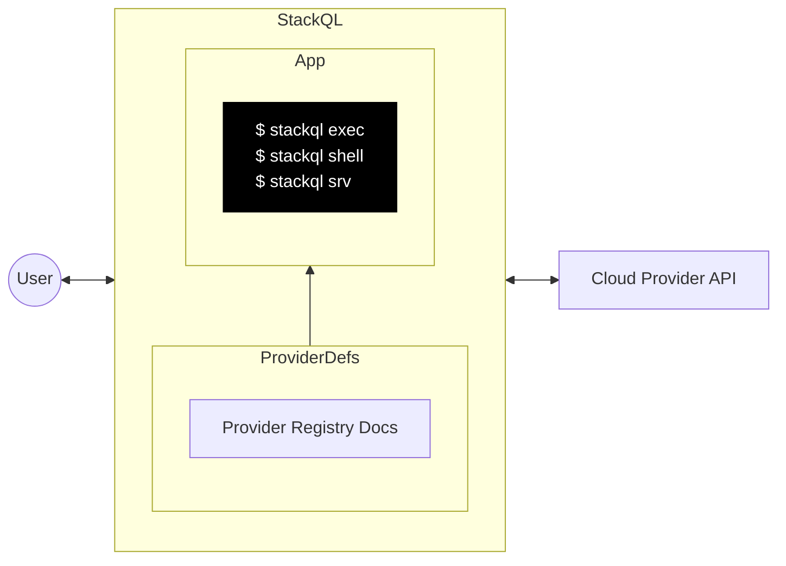

# Bản dịch
- Đây là bản dịch file: [README.md](https://github.com/stackql/stackql/blob/main/README.md) thuộc dự án [StackQL](https://github.com/stackql/stackql).
- Mục đích: Hỗ trợ người Việt Nam có thể hiểu rõ hơn về StackQL.
- Tài liệu chỉ mang tính chất tham khảo, có thể sai sót trong quá trình biên dịch, rất mong được góp ý để có thể cả thiện hơn.


<!-- web assets -->
[logo]: https://stackql.io/img/stackql-logo-bold.png "stackql logo"
[homepage]: https://stackql.io/
[docs]: https://stackql.io/docs
[blog]: https://stackql.io/blog
[registry]: https://github.com/stackql/stackql-provider-registry
[variables]: https://stackql.io/docs/getting-started/variables
[macpkg]: https://storage.googleapis.com/stackql-public-releases/latest/stackql_darwin_multiarch.pkg
[winmsi]: https://releases.stackql.io/stackql/latest/stackql_windows_amd64.msi
[winzip]: https://releases.stackql.io/stackql/latest/stackql_windows_amd64.zip
[tuxzip]: https://releases.stackql.io/stackql/latest/stackql_linux_amd64.zip
<!-- docker links -->
[dockerhub]: https://hub.docker.com/u/stackql
[dockerstackql]: https://hub.docker.com/r/stackql/stackql
[dockerjupyter]: https://hub.docker.com/r/stackql/stackql-jupyter-demo
<!-- github actions links -->
[setupaction]: https://github.com/marketplace/actions/stackql-studios-setup-stackql
[execaction]: https://github.com/marketplace/actions/stackql-studios-stackql-exec
<!-- badges -->
[badge1]: https://img.shields.io/badge/platform-windows%20macos%20linux-brightgreen "Platforms"
[badge2]: https://github.com/stackql/stackql/workflows/Go/badge.svg "Go"
[badge3]: https://img.shields.io/github/license/stackql/stackql "License"
[badge4]: https://img.shields.io/tokei/lines/github/stackql/stackql "Lines"    
<!-- github links -->
[issues]: https://github.com/stackql/stackql/issues/new?assignees=&labels=bug&template=bug_report.md&title=%5BBUG%5D
[features]: https://github.com/stackql/stackql/issues/new?assignees=&labels=enhancement&template=feature_request.md&title=%5BFEATURE%5D
[developers]: /docs/developer_guide.md
[registrycont]: /docs/registry_contribution.md
[designdocs]: /docs/high-level-design.md
[contributing]: /CONTRIBUTING.md
[discussions]: https://github.com/orgs/stackql/discussions
<!-- repo assets -->
[darkmodeterm]: /docs/images/stackql-light-term.gif#gh-dark-mode-only
[lightmodeterm]: /img/stackql-dark-term.gif#gh-light-mode-only
<!-- misc links -->
[twitter]: https://twitter.com/stackql

<!-- language: lang-none -->
<div align="center">

[![logo]][homepage]  
![badge1]
![badge2]
![badge3]
![badge4]

</div>

<div align="center">


</div>
<div align="center">

### Triển khai, quản lý và truy vấn các tài nguyên đám mây cũng như tương tác với các API bằng cách sử dụng SQL.
<!-- <h3 align="center">SQL based XOps, observability and middleware framework</h3> -->

<p align="center">

[__Đọc tài liệu »__][docs]  
[Báo cáo sự cố][issues] · 
[Yêu cầu tính năng][features] · 
[Hướng dẫn dành cho nhà phát triển][developers] · 
[Tự cung cấp nhà cung cấp (BYO Providers)][registrycont]

</p>
</div>

<details open="open">
<summary>Contents</summary>
<ol>
<li><a href="#about-the-project">Về dự án</a></li>
<li><a href="#installation">Cài đặt</a></li>
<li><a href="#usage">Cách sử dụng</a></li>
<!-- <li><a href="#roadmap">Roadmap</a></li> -->
<li><a href="#contributing">Đóng góp</a></li>
<li><a href="#license">Giấy phép</a></li>
<li><a href="#contact">Liên hệ</a></li>
<li><a href="#acknowledgements">Lời cảm ơn</a></li>
</ol>
</details>

## About The Project

[__StackQL__][homepage] Là một dự án mã nguồn mở được xây dựng bằng Golang, cho phép bạn tạo, chỉnh sửa và truy vấn trạng thái của các dịch vụ và tài nguyên trên nhiều giao diện cục bộ và từ xa khác nhau, sử dụng cú pháp SQL. Các giao diện này bao gồm, nhưng không giới hạn ở, các nhà cung cấp dịch vụ đám mây và SaaS như Google, AWS, Azure, Okta, GitHub, v.v.
<br />
<br />

![stackql-shell][darkmodeterm]
![stackql-shell][lightmodeterm]

### Cách hoạt động

StackQL là một ứng dụng độc lập có thể được sử dụng ở chế độ client (thông qua __`exec`__ hoặc __`shell`__) hoặc được truy cập thông qua client sử dụng giao thức Postgres wire (`psycopg2`, v.v.) bằng chế độ server (__`srv`__).  

StackQL phân tích cú pháp các câu lệnh SQL và chuyển đổi chúng thành các yêu cầu API tới nhà cung cấp tài nguyên (đám mây). Sau đó, các lệnh gọi API được thực thi và kết quả được trả về cho người dùng.

Các giao diện nhà cung cấp (provider interfaces) trong StackQL được định nghĩa một cách chuẩn hóa thông qua các phần mở rộng OpenAPI trong đặc tả của từng nhà cung cấp. Các định nghĩa này sau đó được sử dụng để tạo lược đồ SQL (SQL schema) và client API tương ứng.  Nguồn gốc của các định nghĩa nhà cung cấp được lưu trữ trong [__StackQL Registry__][registry].  Ngữ nghĩa của các tương tác với nhà cung cấp được định nghĩa trong [thư viện `any-sdk` của chúng tôi](https://github.com/stackql/any-sdk).  Để biết thêm chi tiết về cách hoạt động bên trong, vui lòng xem tệp
 [tệp cục bộ `AGENTS.md`](/AGENTS.md) và [`any-sdk` của tệp đó](https://github.com/stackql/any-sdk/blob/main/AGENTS.md).

<details>
<summary><b>Sơ đồ ngữ cảnh StackQL</b></summary>
<br />
Sơ đồ ngữ cảnh sau đây mô tả kiến trúc StackQL ở cấp độ tổng quát:  

<!--  -->



Tài liệu thiết kế chi tiết hơn có thể được tìm thấy trong [đây][designdocs].

</details>

## Cài đặt

StackQL có sẵn cho các nền tảng Windows, MacOS, Linux, Docker, GitHub Actions và nhiều hơn nữa. Xem hướng dẫn cài đặt bên dưới phù hợp với nền tảng của bạn.  

<details>
<summary><b>Cài dặt trên MacOS</b></summary>

- Homebrew (`amd64` and `arm64`)
  - `brew install stackql` *hoặc* `brew tap stackql/tap && brew install stackql/tap/stackql`
- Trình cài đăth PKG cho MacOS (`amd64` and `arm64`)
  - tải xuống [trình cài đặt PKG mới nhất cho StackQL][macpkg]
  - chạy trình cài đặt và làm theo hướng dẫn

</details>

<details>
<summary><b>Cài đặt trên Windows</b></summary>

- Trình cài đặt MSI
  - tải xuống [trình cài đặt MSI mới nhất cho StackQL][winmsi]
  - chạy trình cài đặt và làm theo hướng dẫn
- Chocolatey
  - cài đặt [Chocolatey](https://chocolatey.org/install)
  - chạy `choco install stackql`
- ZIP Archive
  - tải xuống [trình cài đặt Windows ZIP archive mới nhất cho StackQL][winzip]
  - giải nén archive (tệp `stackql.exe` đã được kí mã) vào thư mục bạn chọn
  - thêm thư mục đó vào biến môi trường `PATH` (tùy chọn)

</details>

<details>
<summary><b>Cài đặt trên Linux</b></summary>

- ZIP Archive
  - tải xuống [Linux ZIP archive mới nhất cho StackQL][tuxzip]
    - hoặc dùng lệnh `curl -L https://bit.ly/stackql-zip -O && unzip stackql-zip`
  - giải nén archive (tệp `stackql`) vào thư mục bạn chọn
  - thêm thư mục đó vào biến môi trường `PATH` (tùy chọn)

</details>

<details>
<summary><b>Lấy StackQL từ DockerHub</b></summary>

> Xem tất cả các image StackQL có sẵn trên  [__DockerHub__][dockerhub].  Các image có sẵn [__`stackql`__][dockerstackql], [__`stackql-jupyter-demo`__][dockerjupyter] và nhiều hơn nữa. Kéo image StackQL cơ bản mới nhất bằng cách chạy:  

```bash
docker pull stackql/stackql
```

</details>

<details>
<summary><b>Sử dụng StackQL với GitHub Actions</b></summary>

> Sử dụng StackQL trong các workflow GitHub Actions của bạn để tự động hóa việc triển khai hạ tầng đám mây, đảm bảo IaC (Infrastructure as Code), hoặc kiểm tra tuân thủ/bảo mật. Các GitHub Actions có sẵn bao gồm: [`setup-stackql`][setupaction], [`stackql-exec`][execaction] và nhiều hơn nữa

</details>

## Cách sử dụng

StackQL có thể được sử dụng thông qua shell REPL tương tác, hoặc bằng lệnh `exec`, hoặc chạy dưới dạng máy chủ bằng lệnh [Postgres wire protocol](https://www.postgresql.org/docs/current/protocol.html).  

> ℹ️ StackQL không yêu cầu hoặc cài đặt bất kỳ cơ sở dữ liệu nào.

* Interactive Shell
  ```sh
  # run interactive stackql queries
  stackql shell --auth="${AUTH}"
  ```
* Thực thi cá câu lệnh hoặc tập tin
  ```sh
  stackql exec --auth="${AUTH}" -i myscript.iql --iqldata vars.jsonnet --output json
  
  # or
  
  stackql exec --auth="${AUTH}" "SELECT id, status FROM aws.ec2.instances WHERE region = 'us-east-1'"
  ```

  > ℹ️ các tùy chọn định dạng đầu ra `json`, `csv`, `table` và `text` có sẵn cho lệnh `exec` bằng cách sử dụng `--output` flag

  > ℹ️ StackQL hỗ trợ truyền tham số bằng `jsonnet` hoặc `json`, sễme [__Sử dụng biến__][variables]
* Server
  ```sh
  # serve client requests over the Postgres wire protocol (psycopg2, etc.) 
  stackql srv --auth="${AUTH}"
  ```

_Để xem thêm ví dụ, vui lòng truy cập [Blog][blog] của chúng tôi_

<!-- ## Roadmap

See our [__roadmap__](https://github.com/othneildrew/Best-README-Template/issues) to see where we are going with the project. -->

## Đóng góp

Chúng tôi hoan nghênh và khuyến khích mọi đóng góp. Để biết thêm thông tin về cách đóng góp, vui lòng xem [__hướng dẫn đóng góp__][contributing].

## Giấy phép

Phân phối theo Giấy phép MIT. Xem [`LICENSE`](https://github.com/stackql/stackql/blob/main/LICENSE) để biết thêm thông tin.  Các giấy phép cho phần mềm bên thứ ba mà chúng tôi sử dụng được bao gồm trong thư mục [/docs/licenses](/docs/licenses).

## Liên hệ

Liên hệ với chúng tôi qua Twitter tại [__@stackql__][twitter], gửi email đến [__info@stackql.io__](info@stackql.io) hoặc bắt đầu cuộc trò chuyện qua [__discussions__][discussions].

## Lời cảm ơn
Các bản fork từ các dự án sau đây hỗ trợ công việc của chúng tôi:

* [vitess](https://vitess.io/)
* [kin-openapi](https://github.com/getkin/kin-openapi)
* [gorilla/mux](https://github.com/gorilla/mux)
* [readline](https://github.com/chzyer/readline)
* [psql-wire](https://github.com/jeroenrinzema/psql-wire)
* [mcp-postgres](https://github.com/gldc/mcp-postgres)
* [the `golang` MCP SDK](https://github.com/modelcontextprotocol/go-sdk)
* ...và nhiều hơn nữa. Mong bạn thông cảm nếu có bất kỳ thiếu sót nào.

Chúng tôi chân thành cảm ơn những công trình này.